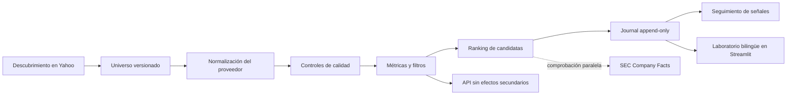

<div align="center">

# Value Investing Screener

**Un pipeline de investigación reproducible para el filtrado fundamental de acciones**

[](https://www.python.org/)
[](https://streamlit.io/)
[](https://pandas.pydata.org/)
[](https://pytest.org/)
[](LICENSE)
[](https://github.com/DiegoRecover8/screener-value-investing/releases/tag/v0.1.0)
[](https://github.com/DiegoRecover8/screener-value-investing/actions/workflows/screener_semanal.yml)

[English](README.md) · [Español](README.es.md)

</div>

---

Un screener educativo de acciones fundamentales inspirado en la *Fórmula
Mágica* de Joel Greenblatt, con controles adicionales de calidad del balance,
coherencia de periodos contables, comparabilidad de divisas, procedencia de los
datos, universos reproducibles y seguimiento longitudinal de señales.

El proyecto descubre acciones mediante Yahoo Finance, calcula métricas explícitas
de valor y calidad, aplica unas reglas de filtrado auditables y clasifica solo las
empresas que cumplen todos los criterios exigidos. Las empresas descartadas
permanecen en la salida con sus métricas y motivos exactos de descarte.

| | Propiedad de investigación | Implementación |
|---|---|---|
| 🧪 | **Metodología comprobable** | Funciones puras de métricas y filtrado con tests de regresión sin conexión |
| 🔎 | **Decisiones auditables** | Cada empresa descartada conserva sus valores y motivos exactos |
| 🧬 | **Población reproducible** | Universos inmutables, registros de configuración y controles SHA-256 |
| ⏱️ | **Histórico punto en el tiempo** | Snapshots append-only y seguimiento sin recalcular retrospectivamente |
| 🛡️ | **Calidad consciente del proveedor** | Controles de periodo, fecha, divisa, completitud y verificación selectiva con la SEC |

---

> [!WARNING]
> **Esto no es asesoramiento financiero.** Este repositorio es un proyecto
> educativo y de investigación. Sus resultados no son recomendaciones para
> comprar, vender o mantener ningún valor, no sustituyen los estados financieros
> de fuentes primarias y no contienen una evaluación cualitativa de una empresa,
> su dirección o su posición competitiva. Las decisiones de inversión son
> responsabilidad exclusiva de quien las toma.

## Alcance de la investigación

Este repositorio constituye el motor de investigación y su registro de auditoría.
Contiene:

- la lógica determinista de métricas, filtros y ranking;
- adaptadores de proveedores y controles de calidad;
- universos oficiales inmutables y versionados;
- la ejecución académica programada y su journal histórico;
- verificación selectiva en paralelo contra SEC EDGAR;
- seguimiento longitudinal de señales anteriores;
- un dashboard experimental en Streamlit;
- una API de Python sin efectos secundarios para interfaces externas.

La pregunta central es deliberadamente acotada: **¿qué empresas de una
población de acciones predefinida y reproducible satisfacen todas las restricciones
de valor, calidad, apalancamiento y crecimiento en un momento concreto?** El
software no estima el valor intrínseco, no predice rentabilidades ni automatiza
una decisión de inversión.

Las aplicaciones interactivas o privadas deben usar la frontera pública definida
en `screener_api.py`. No deben escribir en el journal oficial ni convertir un
análisis *ad hoc* en un snapshot oficial.

La documentación principal en inglés se encuentra en [`README.md`](README.md).

## Diseño del sistema



### Pipeline

1. `universos_yfinance.py` descubre acciones con consultas independientes para
   cada combinación región × sector, evitando el sesgo de paginación global.
2. `providers/` normaliza los fundamentales y registra procedencia, periodo,
   fechas, divisas e incidencias de calidad.
3. `screener_value.py` calcula métricas, agrupa cotizaciones duales conocidas,
   aplica los filtros y clasifica las empresas que los superan.
4. `universos_versionados.py` valida el universo inmutable seleccionado en
   `universos/manifest.json`, incluido su tamaño y hash SHA-256.
5. `ejecutar_semanal.py` crea un snapshot con controles de integridad y lo añade
   al journal histórico.
6. `verificacion_candidatas.py` comprueba opcionalmente las candidatas contra SEC
   Company Facts en modo paralelo.
7. `seguimiento.py` mide el rendimiento posterior sin recalcular decisiones
   históricas con fundamentales actuales.
8. `prompt_llm.py` genera un prompt copiable y acotado sin inventar una tesis.

---

## Reproducción local

Se recomienda Python 3.10 o posterior.

```bash
python3 -m venv .venv
source .venv/bin/activate
python -m pip install --upgrade pip
pip install -r requirements.txt
```

Ejecuta toda la suite de tests sin conexión:

```bash
python -m pytest -v
```

Valida la población activa sin depender de la red:

```bash
python gestionar_universos.py validar
```

## Uso básico

```bash
python universos_yfinance.py usa --salida tickers_usa.txt
python screener_value.py tickers_usa.txt
```

Sin argumentos, `screener_value.py` evalúa una lista de ejemplo. El resultado
más reciente se escribe en `candidatos.csv`, con una fila por empresa, todas las
métricas, la decisión `pasa` y el campo auditable `motivos_descarte`.

### API de aplicación sin efectos secundarios

Las aplicaciones externas deben utilizar `screener_api.py`:

```python
from screener_api import analyze_universe

analysis = analyze_universe(
    ["AAPL", "MSFT", "SAN.MC"],
    thresholds={"per_max": 14.0, "roic_min": 0.12},
)

payload = analysis.to_dict()
print(payload["summary"])
print(payload["candidates"])
print(payload["prompt"])
```

Esta interfaz:

- normaliza y elimina tickers duplicados conservando el orden;
- valida los nombres de los umbrales;
- permite inyectar un proveedor de datos fundamentales;
- no escribe CSV, no actualiza journals ni crea commits;
- devuelve un payload versionado y compatible con JSON;
- separa candidatas y empresas descartadas;
- resume cobertura, calidad y cotizaciones duales;
- proporciona una conclusión determinista y no prescriptiva;
- puede crear el mismo prompt acotado para LLM que el dashboard.

`analyze_fundamentals()` expone la parte determinista para tests, datos en caché
y futuros workers de API.

---

## Metodología

### Métricas

| Métrica | Cálculo | Propósito |
|---|---|---|
| PER | capitalización / beneficio neto | Precio pagado por los beneficios declarados |
| EV/EBIT | (capitalización + deuda − efectivo) / EBIT | Valoración operativa independiente de la financiación |
| Rentabilidad FCF | flujo de caja libre / capitalización | Generación de caja respecto al valor del capital |
| ROIC | EBIT × (1 − tasa fiscal) / capital invertido medio | Rentabilidad aproximada del capital operativo |
| Margen operativo | EBIT / ingresos | Rentabilidad operativa |
| Deuda neta/EBITDA | (deuda − efectivo) / EBITDA | Apalancamiento del balance |
| Cobertura de intereses | EBIT / gasto por intereses | Margen de seguridad para atender la deuda |
| CAGR de ingresos | crecimiento anualizado del histórico disponible | Control de contracción estructural |

### Filtros predeterminados

Los valores de `screener_value.UMBRALES` exigen actualmente:

- PER inferior a 15 y, con suficientes comparables, bajo la mediana sectorial;
- EV/EBIT inferior a 12;
- rentabilidad FCF superior al 6 %;
- ROIC superior al 10 %;
- margen operativo positivo;
- deuda neta/EBITDA inferior a 2,5;
- cobertura de intereses superior a 5;
- CAGR de ingresos no negativo;
- capitalización superior a 2.000 millones de euros.

Superar todos los filtros solo es un resultado cuantitativo, no un juicio sobre
la idoneidad de una inversión.

### Ranking

Solo las empresas que superan todos los filtros entran en el ranking. La
puntuación suma el rango descendente de ROIC y el de rentabilidad de beneficios
(`1 / EV/EBIT`). Una puntuación menor indica una mejor posición combinada.

### Decisiones de diseño importantes

- **Los datos ausentes nunca superan un filtro:** se descartan explícitamente.
- **El capital invertido no resta el efectivo:** hacerlo premiaría dos veces el
  mismo hecho, pues el efectivo ya mejora EV/EBIT.
- **Las medianas de PER usan sector × región comparable:** si el grupo es pequeño,
  se usa la mediana global del sector.
- **Un ROIC extremo se señala, no se celebra:** `roic_fiable=False` identifica
  valores superiores al 100 % potencialmente distorsionados.
- **Las cotizaciones duales se agrupan:** se conserva la de mayor capitalización
  en euros, con desempate determinista.
- **Las divisas deben ser compatibles:** las ratios incompatibles quedan sin valor.
- **Los periodos contables permanecen alineados:** se usa TTM solo cuando cuenta
  de resultados y flujo de caja lo admiten; en otro caso, el último anual.
- **Los estados desactualizados, futuros o desalineados se notifican:** los datos
  revisables, inutilizables o erróneos no pueden producir una candidata.
- **El sistema es diario/semanal, no de tiempo real.**

---

## Universos versionados

### Población de referencia actual

| Propiedad | Valor |
|---|---|
| ID activo | `uv_2026q3_r03` |
| Miembros | 670 símbolos de ticker únicos |
| Clase de activo | Acciones cotizadas |
| Cobertura | 22 regiones desarrolladas × 9 sectores no financieros |
| Descubrimiento | 1.419 símbolos; 198 de 198 grupos completados |
| Selección | Cuotas regionales deterministas y ranking por grupo |
| Refinamiento | 119 cotizaciones duplicadas eliminadas y sustituidas antes de descargar |
| Integridad | Tamaño, esquema canónico y SHA-256 validados antes de una ejecución oficial |

La última observación oficial efectiva (`2026-W36`) descargó los 670 miembros.
La deduplicación en ejecución conservó 645 empresas: 443 con calidad `ok`, 196
`review` y 6 `unusable`. Las otras 25 representaciones agrupadas permanecen
visibles en el control y son un objetivo de refinamiento posterior, no un motivo
para reescribir la versión histórica.

Las cuotas mejoran la amplitud geográfica y sectorial, pero **no** replican un
índice ponderado por capitalización. Se excluyen financieras porque bancos y
aseguradoras requieren definiciones específicas. La pertenencia es un marco de
muestreo documentado, no una afirmación de cobertura global completa.

La ejecución programada nunca reconstruye automáticamente su universo. Resuelve
la entrada `active` de `universos/manifest.json`, valida CSV, tamaño, SHA-256 y
el espejo transitorio `universo.txt`.

Los universos oficiales son inmutables tras activarse. Los cambios se hacen
creando un `draft`, revisando su auditoría y comparación y activándolo manualmente.
El anterior pasa a `retired`, pero no se elimina.

```bash
python gestionar_universos.py mostrar-activo
python gestionar_universos.py validar
python gestionar_universos.py comparar OLD_UNIVERSE_ID NEW_UNIVERSE_ID
python gestionar_universos.py activar NEW_UNIVERSE_ID
```

Los resultados de `universos/descubrimiento/` nunca son oficiales por sí solos.
Los informes conservan las reglas y procedencia necesarias para reproducir un borrador.

---

## Automatización semanal y registro de auditoría

`.github/workflows/screener_semanal.yml` se ejecuta cada lunes a las 07:00 UTC y
puede iniciarse manualmente como prueba o ejecución oficial.

**No hace falta intervenir cada semana.** `schedule` inicia automáticamente la
ejecución oficial desde la rama predeterminada; `workflow_dispatch` permite
pruebas controladas y revisiones explícitas. Según la documentación de
[`schedule`](https://docs.github.com/en/actions/reference/workflows-and-actions/events-that-trigger-workflows#schedule),
los trabajos pueden retrasarse y, en repositorios públicos, se desactivan tras
60 días sin actividad. Conviene revisar periódicamente Actions.

El workflow:

1. ejecuta toda la suite de tests;
2. resuelve y valida el universo;
3. exige al menos un 80 % de descargas correctas;
4. añade el snapshot a `journal_candidatos.csv`;
5. registra su integridad en `ejecuciones_screener.csv`;
6. actualiza seguimiento e `historico.json` solo en ejecuciones oficiales;
7. crea un commit con los artefactos modificados.

La concurrencia usa `cancel-in-progress: false`: una descarga activa no se
cancela y otra ejecución espera antes de escribir el histórico compartido.

```bash
python ejecutar_semanal.py --universo-activo journal_candidatos.csv
python ejecutar_semanal.py my_list.txt journal_test.csv control_test.csv
```

`journal_candidatos.csv` es append-only y cada fila contiene fecha UTC, semana
ISO y `snapshot_id`. `ejecuciones_screener.csv` registra cobertura, calidad,
candidatas, tipo de ejecución, identidad de GitHub Actions e ID y hash del universo.

Si una semana tiene varias revisiones oficiales, la mayor revisión es el snapshot
efectivo. Las anteriores permanecen para auditoría, pero no alimentan seguimiento.

## Verificación selectiva con la SEC

En modo paralelo se comprueban solo las candidatas contra SEC EDGAR Company
Facts. El diagnóstico nunca modifica `pasa`, ranking, journal ni `snapshot_id`.

Para activarlo en Actions, crea el secreto `SEC_USER_AGENT`:

```text
screener-value-investing contact@example.com
```

`verificacion_candidatas.csv` registra cada snapshot, ticker y componente:

- `verificado`: diferencia de hasta el 10 %;
- `advertencia`: superior al 10 % y hasta el 25 %;
- `discrepancia_material`: superior al 25 %;
- `aproximacion_semantica`: medida útil pero no equivalente;
- `no_comparable`: fecha, periodo o divisa incompatibles;
- `sin_dato`: falta un componente;
- `sin_cobertura`: ticker sin cobertura o API sin respuesta.

Nunca se eliminan sufijos para fabricar cobertura SEC. Proxies como `ProfitLoss`,
`Equity` y `OperatingIncomeLoss` conservan la diferencia, pero no se presentan
como equivalentes directos. Consulta la
[documentación oficial de SEC EDGAR](https://www.sec.gov/search-filings/edgar-application-programming-interfaces).

## Seguimiento longitudinal

`ejecutar_seguimiento.py` lee snapshots oficiales efectivos, identifica entradas
válidas y sigue cada señal desde el primer cierre ajustado disponible. Una
reentrada crea una señal nueva y una descarga ausente no fabrica una salida.

Registra rentabilidad ponderada por tiempo y *maximum drawdown* en el archivo
append-only `seguimiento_candidatas.csv`. Nunca recalcula decisiones históricas
con fundamentales actuales, evitando el *look-ahead bias*.

```bash
python ejecutar_seguimiento.py journal_candidatos.csv seguimiento_candidatas.csv
```

---

## Laboratorio de investigación bilingüe en Streamlit

El dashboard es una interfaz de investigación, no un producto de asesoramiento:

```bash
streamlit run dashboard.py
```

El inglés es el idioma predeterminado y los controles 🇬🇧/🇪🇸 cambian la
sesión al español. Admite universos manuales, de descubrimiento y el oficial;
descargas en caché; sliders; filtros; gráficos; snapshots y un prompt acotado
para LLM. El selector del
[gráfico de TradingView](https://www.tradingview.com/widget-docs/widgets/charts/advanced-chart)
se limita a candidatas reales ordenadas por el ranking y nunca elige un ticker
descartado al azar.

La interfaz está separada de la escritura oficial: el histórico es de solo lectura
y un análisis en vivo no se convierte en snapshot. Las aplicaciones externas o
privadas deben consumir `screener_api.py`.

## Limitaciones de las fuentes de datos

`yfinance` es el proveedor predeterminado, no una fuente autoritativa. Sus
limitaciones conocidas incluyen:

- cobertura fundamental desigual fuera de Estados Unidos;
- agregados TTM ausentes en algunos mercados;
- metadatos de divisa ausentes o incoherentes;
- paginación poco fiable en descubrimientos globales grandes;
- posibles cambios de esquema, disponibilidad o límites;
- ninguna garantía de exactitud solo porque una petición funcionó.

La abstracción permite inyectar otro proveedor y el adaptador SEC aporta evidencia
selectiva independiente para emisores estadounidenses. El proyecto no mezcla
silenciosamente cifras incompatibles ni decide qué fuente discrepante es correcta.

Antes de desplegar un servicio público o comercial, revisa de forma independiente
los términos, licencias y requisitos de redistribución de cada proveedor.

---

## Mapa del repositorio

| Ruta | Responsabilidad |
|---|---|
| `screener_value.py` | Métricas, filtros, ranking y CLI heredada |
| `screener_api.py` | Frontera estable sin efectos secundarios |
| `providers/` | Adaptadores primarios y secundarios |
| `universos/` | Artefactos oficiales, de descubrimiento y selección |
| `universos_versionados.py` | Validación del manifest y de integridad |
| `ejecutar_semanal.py` | Ejecución semanal controlada |
| `journal.py` | Histórico de snapshots e integridad |
| `seguimiento.py` | Ciclo de vida y rendimiento de señales |
| `verificacion_candidatas.py` | Comparación selectiva con segunda fuente |
| `prompt_llm.py` | Prompt de interpretación acotado |
| `dashboard.py` | Interfaz local bilingüe en Streamlit |
| `test_*.py` | Tests sin conexión, de regresión y contrato |

## Estado de la hoja de ruta

- [x] Motor reproducible y tests de regresión sin conexión.
- [x] Dashboard bilingüe con gráficos vinculados a candidatas.
- [x] Ejecución semanal con Actions y journal append-only.
- [x] Seguimiento longitudinal sin sesgo de anticipación.
- [x] Prompt copiable para LLM independiente del proveedor.
- [x] Universos versionados y selección reproducible amplia.
- [x] Refinamiento previo de cotizaciones duales.
- [x] Controles del proveedor y verificación selectiva SEC.
- [x] API estable compatible con JSON.
- [x] Primera versión estable del motor (`v0.1.0`).
- [x] Frontera para una interfaz web privada separada.

## Contribución y uso responsable

Los cambios en fórmulas, umbrales, selección del universo o semántica de
snapshots deben incluir tests y explicar su efecto metodológico. No incluyas
secretos, direcciones usadas en cabeceras HTTP, resultados generados ni entradas
privadas de usuarios.

Trata cada resultado como un punto de partida para investigar fuentes primarias,
nunca como una recomendación de inversión.

---

## Licencia

Este proyecto se publica bajo la [Licencia MIT](LICENSE).
