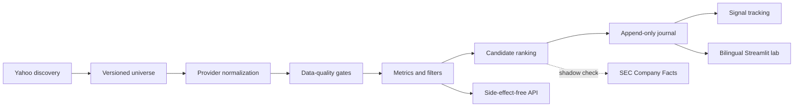

<div align="center">

# Value Investing Screener

**A reproducible research pipeline for fundamental equity screening**

[](https://www.python.org/)
[](https://streamlit.io/)
[](https://pandas.pydata.org/)
[](https://pytest.org/)
[](https://github.com/DiegoRecover8/screener-value-investing/releases/tag/v0.1.0)
[](https://github.com/DiegoRecover8/screener-value-investing/actions/workflows/screener_semanal.yml)

[English](README.md) · [Español](README.es.md)

</div>

---

An educational fundamental equity screener inspired by Joel Greenblatt's
*Magic Formula*, with additional controls for balance-sheet quality, accounting
period consistency, currency comparability, data provenance, reproducible
universes and longitudinal signal tracking.

The project discovers equities through Yahoo Finance, calculates explicit value
and quality metrics, applies an auditable filtering rubric and ranks only the
companies that pass every required criterion. Rejected companies remain in the
output with their metrics and exact rejection reasons.

| | Research property | Implementation |
|---|---|---|
| 🧪 | **Testable methodology** | Pure metric and filtering functions with offline regression tests |
| 🔎 | **Auditable decisions** | Every rejected company keeps its values and exact rejection reasons |
| 🧬 | **Reproducible population** | Immutable universe files, configuration records and SHA-256 controls |
| ⏱️ | **Point-in-time history** | Append-only snapshots and signal tracking without retrospective re-screening |
| 🛡️ | **Provider-aware quality** | Period, date, currency, completeness and selective SEC cross-check controls |

---

> [!WARNING]
> **This is not financial advice.** This repository is an educational and
> research project. Its results are not recommendations to buy, sell or hold any
> security, do not replace primary-source financial statements and contain no
> qualitative assessment of a company, its management or competitive position.
> Investment decisions remain the sole responsibility of the person making
> them.

## Research scope

This repository is the research engine and audit trail. It contains:

- the deterministic metric, filter and ranking logic;
- data-provider adapters and quality controls;
- immutable, versioned official universes;
- the scheduled academic run and its historical journal;
- selective shadow verification against SEC EDGAR;
- longitudinal tracking of past signals;
- an experimental Streamlit dashboard;
- a side-effect-free Python API for external user interfaces.

The central research question is deliberately narrow: **which companies in a
predefined, reproducible equity population satisfy all stated value, quality,
leverage and growth constraints at a given observation time?** The software
does not estimate intrinsic value, forecast returns or automate an investment
decision.

Interactive or private applications should consume the public Python boundary
in `screener_api.py`. They must not write to the official journal or turn an
ad-hoc user analysis into an official snapshot.

The previous full Spanish documentation is preserved in
[`README.es.md`](README.es.md).

## System design



### Pipeline

1. `universos_yfinance.py` discovers equities through separate Yahoo Finance
   queries for every region × sector pair. This avoids the geographical bias
   observed when a large global result is paginated.
2. `providers/` normalizes raw fundamental data and records its provenance,
   accounting period, statement dates, currencies and quality incidents.
3. `screener_value.py` calculates metrics, collapses known dual listings,
   applies all filters and ranks passing companies.
4. `universos_versionados.py` validates the immutable official universe selected
   in `universos/manifest.json`, including its member count and SHA-256 hash.
5. `ejecutar_semanal.py` creates an integrity-controlled snapshot and appends it
   to the historical journal.
6. `verificacion_candidatas.py` optionally checks only the passing companies
   against SEC Company Facts in shadow mode.
7. `seguimiento.py` tracks real post-signal performance without recalculating
   historical selection decisions using current fundamentals.
8. `prompt_llm.py` creates a copyable, constrained prompt that describes the
   calculated results without inventing an investment thesis.

---

## Reproduce locally

Python 3.10 or later is recommended.

```bash
python3 -m venv .venv
source .venv/bin/activate
python -m pip install --upgrade pip
pip install -r requirements.txt
```

Run the complete offline test suite:

```bash
python -m pytest -v
```

Validate the currently active population independently of network access:

```bash
python gestionar_universos.py validar
```

## Basic usage

Build an optional ticker universe and run the screener:

```bash
python universos_yfinance.py usa --salida tickers_usa.txt
python screener_value.py tickers_usa.txt
```

With no arguments, `screener_value.py` evaluates a small example list. The
latest point-in-time result is written to `candidatos.csv`. It contains one row
per evaluated company, every calculated metric, the `pasa` decision and the
auditable `motivos_descarte` field.

### Side-effect-free application API

External applications should use `screener_api.py` rather than calling the
weekly runner:

```python
from screener_api import analyze_universe

analysis = analyze_universe(
    ["AAPL", "MSFT", "SAN.MC"],
    thresholds={"per_max": 14.0, "roic_min": 0.12},
)

payload = analysis.to_dict()
print(payload["summary"])
print(payload["candidates"])
print(payload["prompt"])
```

This interface:

- normalizes and de-duplicates ticker input while preserving order;
- validates threshold names;
- supports an injectable fundamental-data provider;
- performs no CSV writes, journal updates or Git commits;
- returns a versioned, JSON-compatible payload;
- separates candidates and rejected companies;
- includes coverage, quality and dual-listing summaries;
- provides a deterministic, non-advisory screening conclusion;
- can produce the same constrained LLM prompt used by the dashboard.

`analyze_fundamentals()` exposes the deterministic part of the pipeline for
tests, cached data and future API workers.

---

## Methodology

### Metrics

| Metric | Calculation | Purpose |
|---|---|---|
| P/E | market capitalization / net income | Price paid for reported earnings |
| EV/EBIT | (market cap + debt − cash) / EBIT | Operating-business valuation independent of financing |
| FCF yield | free cash flow / market cap | Cash generation relative to equity value |
| ROIC | EBIT × (1 − tax rate) / average invested capital | Approximate return on operating capital |
| Operating margin | EBIT / revenue | Operating profitability |
| Net debt/EBITDA | (debt − cash) / EBITDA | Balance-sheet leverage |
| Interest coverage | EBIT / interest expense | Debt-service margin of safety |
| Revenue CAGR | annualized growth over the available history | Structural revenue contraction control |

### Default filters

The defaults live in `screener_value.UMBRALES` and currently require:

- P/E below 15 and, when enough peers exist, below the relevant sector median;
- EV/EBIT below 12;
- FCF yield above 6%;
- ROIC above 10%;
- positive operating margin;
- net debt/EBITDA below 2.5;
- interest coverage above 5;
- non-negative revenue CAGR;
- market capitalization above EUR 2 billion.

Passing every filter is only a quantitative screening result. It is not a
judgment about investment suitability.

### Ranking

Only passing companies enter the ranking. The composite score adds the
descending ROIC rank and the descending earnings-yield (`1 / EV/EBIT`) rank.
A lower score represents a stronger combined position on those two dimensions.

### Important design decisions

- **Missing data never passes a filter.** A missing metric is rejected with an
  explicit reason instead of being imputed or silently ignored.
- **Invested capital does not subtract cash.** Cash already improves EV/EBIT;
  subtracting it again from ROIC would reward the same balance-sheet fact twice.
- **P/E peer medians use sector × comparable region.** If the regional group is
  too small, the calculation falls back to the global sector median.
- **Extreme ROIC is flagged, not celebrated.** `roic_fiable=False` marks values
  above 100%, where a very small capital base can make the ratio misleading.
- **Dual listings are collapsed.** The engine retains the listing with the
  highest EUR market capitalization, with deterministic tie-breaking.
- **Currencies must be compatible.** Ratios combining market and accounting
  data become unavailable if their currencies cannot be compared safely.
- **Accounting periods stay aligned.** TTM figures are used only when both the
  income statement and cash-flow data support TTM. Otherwise, the latest annual
  period is used consistently.
- **Stale, future-dated or misaligned statements are reported.** Data marked as
  review, unusable or error cannot become a candidate.
- **The system is daily/weekly, not real time.** Fundamental analysis does not
  require intraday streaming.

---

## Versioned universes

### Current reference population

| Property | Value |
|---|---|
| Active ID | `uv_2026q3_r03` |
| Members | 670 unique ticker symbols |
| Asset class | Listed equities |
| Coverage design | 22 developed-market regions × 9 non-financial sectors |
| Discovery snapshot | 1,419 symbols; all 198 requested buckets completed |
| Selection | Deterministic regional quotas and within-bucket rank |
| Refinement | 119 observed duplicate listings removed before download and replaced deterministically |
| Integrity | Member count, canonical schema and SHA-256 verified before an official run |

The latest effective official observation (`2026-W36`) requested and downloaded
all 670 members. Runtime issuer de-duplication retained 645 evaluated companies:
443 were classified as data-quality `ok`, 196 as `review`, and 6 as `unusable`.
The 25 additional representations collapsed at runtime are visible in the
execution control rather than hidden. They are a documented target for a later
universe refinement, not grounds for rewriting this historical version.

The quotas improve geographic and sector breadth, but they do **not** claim to
replicate a market-cap-weighted index. Financial companies are excluded because
bank and insurer statements require sector-specific leverage and cash-flow
definitions. Membership is a documented sampling frame for this methodology,
not a statement that every eligible global security is represented.

The scheduled run never rebuilds its target universe automatically. It resolves
the single `active` entry in `universos/manifest.json`, validates the referenced
CSV, member count and SHA-256 hash, and checks the transitional `universo.txt`
mirror.

Official universe files are immutable after activation. Membership changes are
made by creating a `draft`, reviewing its audit data and comparison, and then
activating it manually. The previous universe becomes `retired` but is not
deleted.

Useful commands:

```bash
python gestionar_universos.py mostrar-activo
python gestionar_universos.py validar
python gestionar_universos.py comparar OLD_UNIVERSE_ID NEW_UNIVERSE_ID
python gestionar_universos.py activar NEW_UNIVERSE_ID
```

Discovery outputs under `universos/descubrimiento/` are never official by
themselves. Selection and refinement reports retain the rules and provenance
needed to reproduce a draft.

---

## Weekly automation and audit trail

`.github/workflows/screener_semanal.yml` runs every Monday at 07:00 UTC and can
also be started manually. A manual run must be classified as either a test or
an official run.

**No weekly click is required.** The `schedule` trigger launches the official
run automatically from the default branch. `workflow_dispatch` exists for
controlled tests and explicit official revisions. As documented for GitHub's
[`schedule` event](https://docs.github.com/en/actions/reference/workflows-and-actions/events-that-trigger-workflows#schedule),
jobs may be delayed under platform load; in a public repository schedules are
also disabled after 60 days without repository activity, so the Actions page
should be part of the maintenance review.

The workflow:

1. runs the complete offline test suite;
2. resolves and validates the selected universe;
3. evaluates it and requires at least 80% successful downloads;
4. appends a valid snapshot to `journal_candidatos.csv`;
5. appends one integrity row to `ejecuciones_screener.csv`;
6. updates tracking and `historico.json` only for scheduled or official runs;
7. commits changed historical artifacts.

The concurrency group uses `cancel-in-progress: false`. An active download is
not cancelled halfway through and another run must wait before checking out and
writing shared history.

An official run must use `--universo-activo`. Ad-hoc files and explicitly chosen
universe IDs are restricted to tests:

```bash
python ejecutar_semanal.py --universo-activo journal_candidatos.csv
python ejecutar_semanal.py my_list.txt journal_test.csv control_test.csv
```

`journal_candidatos.csv` is append-only. Each row includes its UTC execution
timestamp, ISO week and `snapshot_id`. `ejecuciones_screener.csv` stores one row
per valid snapshot, including coverage, quality, candidate count, official/test
classification, GitHub run identity and the exact universe ID and hash.

If a week has more than one official revision, the highest revision is the
effective official snapshot. Older revisions are retained for audit purposes
but do not feed signal tracking or the exported logbook.

## Selective SEC verification

The project does not redownload the entire universe from a second source. In
shadow mode, it checks only passing candidates against the SEC EDGAR Company
Facts API. This diagnostic never modifies `pasa`, ranking, the journal or the
snapshot identity.

To enable it in GitHub Actions, create the repository secret
`SEC_USER_AGENT`. Use an identifying value such as:

```text
screener-value-investing contact@example.com
```

The output is appended to `verificacion_candidatas.csv` for each snapshot,
ticker and accounting component. Possible states are:

- `verificado`: relative difference up to 10%;
- `advertencia`: difference above 10% and up to 25%;
- `discrepancia_material`: difference above 25%;
- `aproximacion_semantica`: useful but conceptually non-equivalent measure;
- `no_comparable`: incompatible date, period or currency;
- `sin_dato`: a component is missing;
- `sin_cobertura`: the exact ticker is not covered or the API did not respond.

Market suffixes are never removed to manufacture SEC coverage. Semantic proxies
such as `ProfitLoss`, `Equity` and `OperatingIncomeLoss` preserve the numerical
difference but are not presented as direct equivalents of attributable income,
shareholder equity or EBIT. See the official
[SEC EDGAR API documentation](https://www.sec.gov/search-filings/edgar-application-programming-interfaces).

## Longitudinal tracking

`ejecutar_seguimiento.py` reads only effective official snapshots, identifies
valid transitions into a passing state and tracks each signal from its first
available adjusted close on or after entry. A later re-entry creates a new
signal. Missing downloads do not manufacture exits.

It records time-weighted return and maximum drawdown in the append-only
`seguimiento_candidatas.csv`. Historical candidate decisions are never
recomputed using today's fundamentals, preventing look-ahead bias.

```bash
python ejecutar_seguimiento.py journal_candidatos.csv seguimiento_candidatas.csv
```

---

## Bilingual Streamlit research lab

The local dashboard is a research interface, not a hosted advisory product:

```bash
streamlit run dashboard.py
```

English is the default language and the 🇬🇧/🇪🇸 controls switch the
session to Spanish. It supports manual, discovery and active official universes,
cached downloads, threshold sliders, filterable results, composition charts,
historical snapshots and a constrained LLM prompt. The
[TradingView Advanced Chart](https://www.tradingview.com/widget-docs/widgets/charts/advanced-chart)
selector is intentionally limited to actual candidates and orders them by the
screener ranking; it never chooses an arbitrary rejected ticker.

The interface is intentionally separate from the official write path. Browsing
history is read-only, and a live analysis does not become an official snapshot.
External or private applications should consume `screener_api.py`.

## Data-source limitations

`yfinance` is the default provider, not an authoritative financial-data source.
Known limitations include:

- uneven fundamental coverage outside the United States;
- missing TTM aggregates in some markets;
- missing or inconsistent financial-currency metadata;
- unreliable pagination for very large global discovery queries;
- possible upstream schema, availability and rate-limit changes;
- no guarantee that a figure is correct merely because the request succeeded.

The provider abstraction makes another source injectable, while the SEC adapter
adds selective independent evidence for US issuers. The project does not silently
merge incompatible figures or decide which of two conflicting sources is true.

The software is intended for research and educational use. Before deploying any
public or commercial service, independently review the data providers' current
terms, licensing and redistribution requirements.

---

## Repository map

| Path | Responsibility |
|---|---|
| `screener_value.py` | Metrics, filters, ranking and legacy CLI |
| `screener_api.py` | Stable side-effect-free application boundary |
| `providers/` | Primary and secondary provider adapters |
| `universos/` | Versioned official, discovery and selection artifacts |
| `universos_versionados.py` | Manifest and integrity validation |
| `ejecutar_semanal.py` | Controlled weekly execution |
| `journal.py` | Snapshot and integrity history |
| `seguimiento.py` | Signal lifecycle and performance tracking |
| `verificacion_candidatas.py` | Selective second-source comparison |
| `prompt_llm.py` | Constrained interpretation prompt |
| `dashboard.py` | Bilingual local Streamlit research interface |
| `test_*.py` | Offline unit, regression and contract tests |

## Roadmap status

- [x] Reproducible metric engine and offline regression tests.
- [x] Bilingual Streamlit research dashboard with candidate-linked charts.
- [x] Weekly GitHub Actions execution and append-only journal.
- [x] Longitudinal tracking without look-ahead bias.
- [x] Copyable, provider-neutral LLM prompt.
- [x] Versioned official universes and reproducible broad-universe selection.
- [x] Pre-download refinement of observed dual listings.
- [x] Primary-provider quality controls and selective SEC shadow verification.
- [x] Stable JSON-compatible application API.
- [x] Tag the first stable research-engine release (`v0.1.0`).
- [x] Expose a stable boundary for a separately deployed private web interface.

## Contributing and responsible use

Changes to formulas, thresholds, universe selection or snapshot semantics should
include offline tests and an explanation of their methodological effect. Do not
commit secrets, contact addresses used in HTTP headers, generated point-in-time
outputs or private user inputs.

Please treat every result as a starting point for primary-source research, never
as an investment recommendation.
